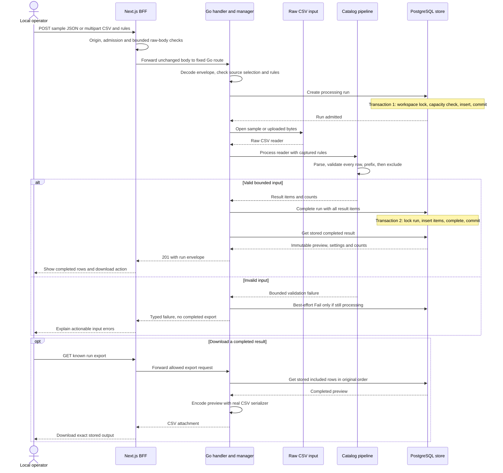
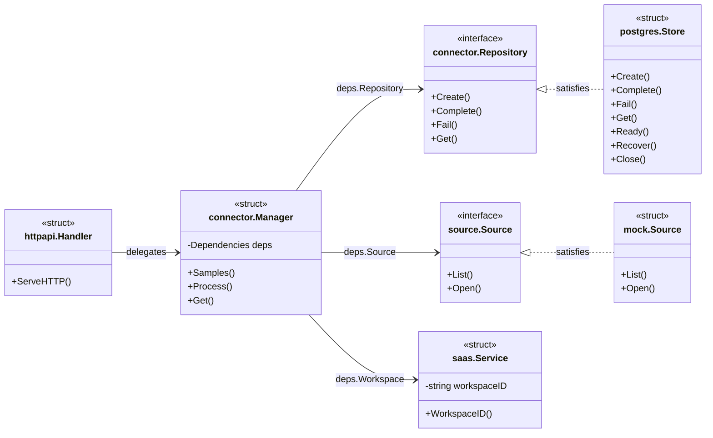

# Current application architecture

This document describes the **implemented CSV-processing slice**. It does not depict the revised
owner login, connected Shopify/feed providers or mock Meta publication as working code. Those
contracts have separate [specified architecture diagrams](../specs/001-catalog-workflow/architecture-diagrams.md).
Source was reviewed on 2026-09-13; diagram review is not a new runtime or test result.

## System boundary

Next.js provides the browser interface and same-origin backend-for-frontend (BFF). One Go process
coordinates raw CSV intake, validation, two deterministic rules and result persistence. PostgreSQL
stores settings and normalized/transformed rows; raw input is transient. SaaS and Connector Manager
are Go package responsibilities, not separate deployments.

The current actor is a trusted local operator using an unauthenticated demo workspace. The SaaS
service currently returns a configured workspace ID; it does not authenticate a user. Browser-origin
checks and loopback access do not replace the real owner/session boundary specified for the revision.

## Current processing sequence

The diagram follows a successful sample/upload request and its validation-failure alternative.
`PostgreSQL store` combines the repository adapter and its database to keep the sequence readable.

Source opening can fail before the pipeline call; that path skips parsing and uses the same
conditional failed-run recording. Invalid envelopes fail before run creation. If completion commits
but the response is lost, the completed result stands; a transport error does not prove rollback.
On startup, leftover processing rows become failed/interrupted, without raw-input resume.

The pipeline validates excluded products too. A valid input with every product excluded still
completes and produces a header-only CSV. Preview/download are rebuilt from stored included rows,
not current browser controls.

## Current Go types and dependencies

This is UML-style notation for **Go structs and interfaces**, not class inheritance. Dashed
realization arrows mean the concrete type satisfies an interface implicitly. Method signatures are
abbreviated; the linked source owns exact parameters and return values. Package constructor functions
such as `connector.New` are not represented as methods.

`model.Source` is a separate metadata struct; it is not the `source.Source` interface above.
The raw source contract is currently CSV-only. Its existence does not establish provider
authorization, asset discovery or a production-commerce adapter.

## Composition and source map

| Area | Source and responsibility |
|---|---|
| Browser state | [`CatalogWorkflow`](../frontend/src/components/catalog-workflow.tsx#L46) captures settings, restores a known run and displays server results. |
| Browser API client | [`processCatalog`, `loadRun`, `downloadRun`](../frontend/src/lib/catalog-client.ts#L69) use the current catalog endpoints. |
| BFF | [`createCatalogProxy`](../frontend/src/lib/server/catalog-proxy.ts#L72) enforces shared request bounds and fixed raw forwarding; [`proxyCatalog`](../frontend/src/lib/server/catalog-service.ts#L7) shares its instance. |
| Bootstrap | [`bootstrap`](../backend/cmd/app/bootstrap.go#L11) injects `mock.BuiltIn()`; [`app.New`](../backend/internal/app/app.go#L26) constructs the store, workspace service, manager, handler and HTTP server. |
| Lifecycle | [`app.App`](../backend/internal/app/app.go#L20) owns server/store closure and graceful shutdown. It currently has no database-session lifecycle guard. |
| HTTP/domain boundary | [`httpapi.Handler`](../backend/internal/httpapi/catalog.go#L42) delegates to [`connector.Manager`](../backend/internal/connector/manager.go#L66). |
| Real catalog stages | [`pipeline.Process`](../backend/internal/catalog/pipeline/process.go#L20) calls parser, validator and transformation functions. |
| Persistence | [`Store.Create`](../backend/internal/store/postgres/runs.go#L95), [`Complete`](../backend/internal/store/postgres/runs.go#L130), [`Fail`](../backend/internal/store/postgres/runs.go#L180), and [`Get`](../backend/internal/store/postgres/runs.go#L200) implement run transitions. |
| Projection/export | [`readPreview`](../backend/internal/store/postgres/runs.go#L266) reconstructs included stored rows; [`export.CSV`](../backend/internal/catalog/export/csv.go#L12) encodes them. `Store.Get` does not call the separate `model.Project` helper. |
| Database schema | [Migration 001](../backend/migrations/202609130001_catalog.up.sql) defines workspaces, processing_runs and result_items. |
| Failure composition | [`cmd/testserver`](../backend/cmd/testserver/main.go#L1) requires a test build tag and overrides source opening while retaining real application construction. |

The current database pool permits five connections. Admission is bounded to two POST and four
read/export requests per process; CSV is limited to 1 MiB/1,000 products. Exact decimal strings
become `numeric(18,4)` only after lexical validation. Details and operational limits belong in the
[runbook](runbook.md), with assessed controls and limitations in [security.md](security.md).

## What the revision adds

The reviewed specification adds real users/memberships/sessions, simulated connection lifecycles,
Shopify-like JSON normalization, multiple catalog choices, mock Meta publication and independent
effect/readback persistence. It also specifies an exclusive lifecycle guard and ordered migration
upgrade. These are not present in the implementation shown above. Follow the
[active tasks](../specs/001-catalog-workflow/tasks.md) and
[specified diagrams](../specs/001-catalog-workflow/architecture-diagrams.md) for that work.
