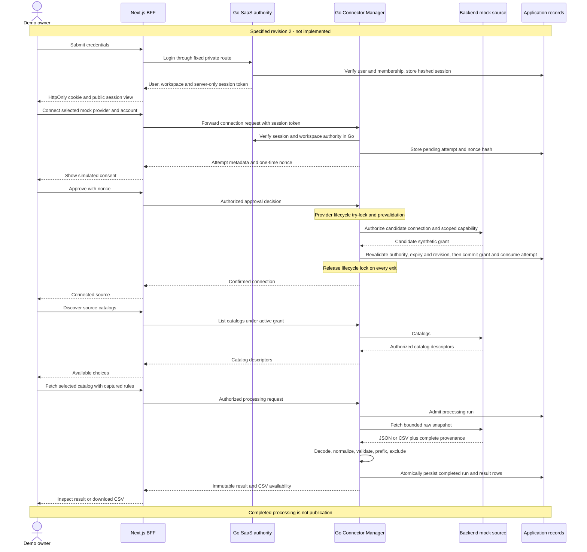
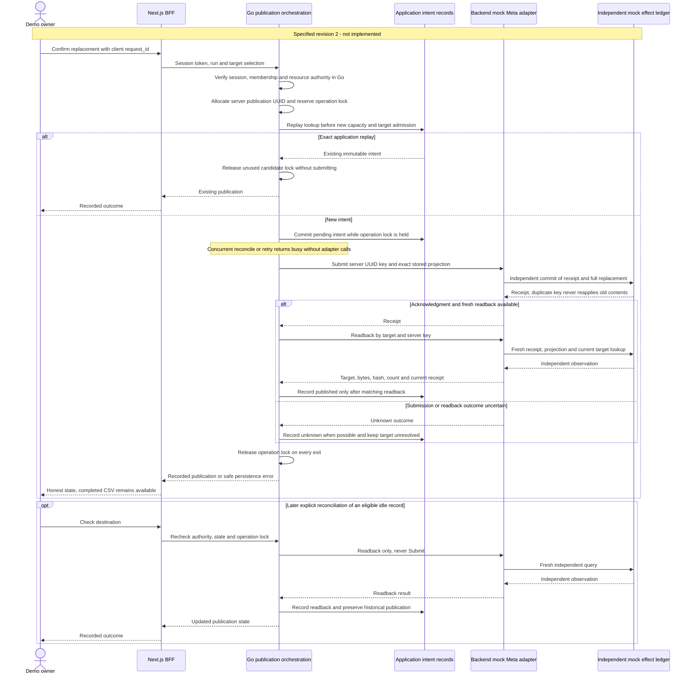
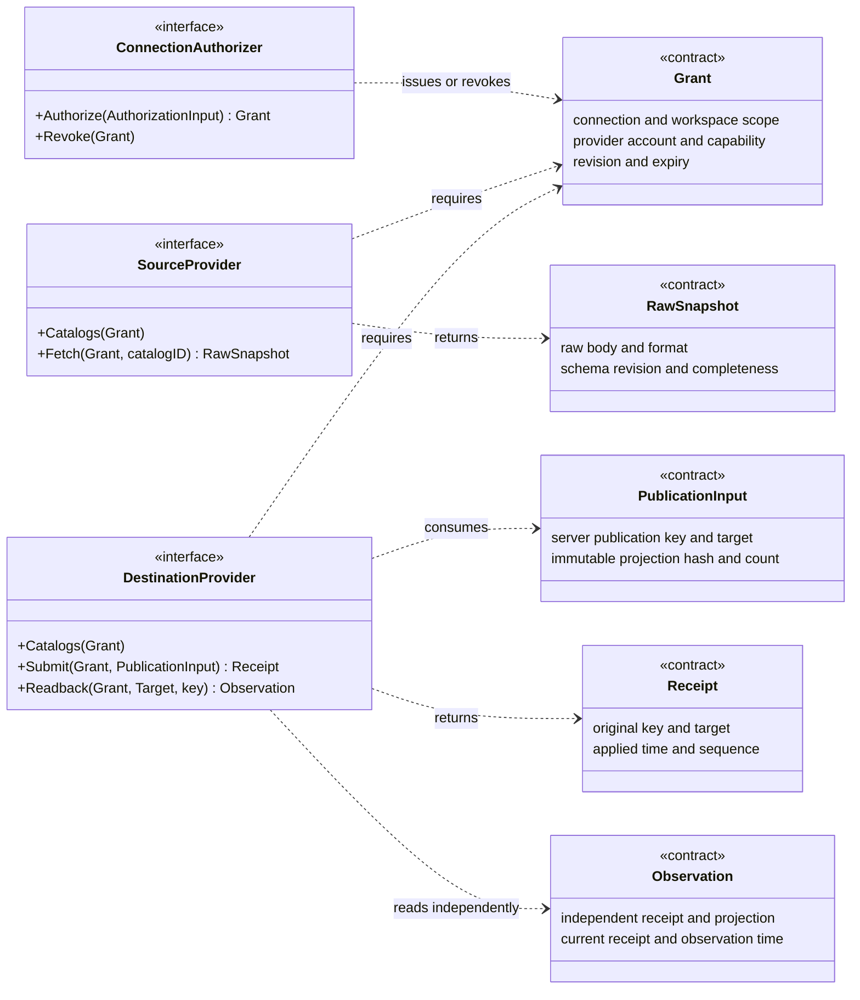

# Specified owner-journey architecture

**Specified, not implemented.** These three diagrams visualize the reviewed revision-2 contracts,
not the current executable. The [current architecture](../../docs/architecture.md) separately describes
the implemented CSV slice. Diagram participants are responsibilities or documented contract types;
they do not imply deployed services or existing concrete Go classes.

The [specification](spec.md) and [owner-journey revision](owner-journey-revision.md) own product scope.
[API](contracts/catalog-api.md), [provider ports](contracts/provider-ports.md) and
[data model](data-model.md) own exact signatures, states, limits and transaction rules. These visuals
are explanatory views, not an additional authority for those definitions.

## Specified owner-to-catalog sequence

All protected requests pass Go session/membership/resource checks, including requests abbreviated
below. SaaS and Connector Manager remain in one Go process. The source participant represents either
the Shopify-like JSON mock or generic-feed CSV mock; upload remains an authenticated alternative.

Denied/cancelled/expired attempts issue no active grant. Approval calls the mock outside any app
transaction, then revalidates before consuming the attempt. Lost creation responses are recovered
through the safe attempt list; a lost nonce is not disclosed again. An unexpired pending attempt can
be cancelled/restarted; an expired one permits a fresh attempt directly. Source failure/incompleteness
does not become successful empty input. Disconnect blocks new authority admissions but cannot promise
to retract already authorized in-flight work.

## Specified publication and recovery sequence

Prerequisites: authenticated owner, an immutable nonempty completed run and an active authorized
mock Meta target. The full-replacement confirmation binds that exact run and target. App replay key
and provider idempotency key are different. The two database participants below are independent
repositories/transactions, even though this demo specifies one physical PostgreSQL server.

The uncertainty branch may follow a committed replacement; it does not promise unchanged destination
contents. A definite no-effect rejection records failed and preserves prior contents. Pending after
crash becomes unknown. Failed records cannot reconcile away a permanent rejection: only eligible
definite not-applied/latest intents can explicitly retry, using the original server key. Unknown
must reconcile first; a busy operation permits neither action. See the
[action eligibility matrix](contracts/catalog-api.md#action-eligibility).

Historical receipt and current target are different facts. A newer replacement does not invalidate
the earlier receipt, and replaying its key does not restore old contents. Application reset leaves
mock effects intact; independent mock reset is a separate guarded operation. Neither reset is a
public endpoint. For pending/unknown intent, authoritative absence can settle failed/not-applied.
Absence after a previously verified publication preserves that historical published record and reports
missing current effect; it does not rewrite history or silently reapply the old output.

## Specified provider-contract types

This UML-style diagram shows the **documented Go interface contracts and value names**, not source
declarations or concrete classes. Signatures are abbreviated; each operation accepts context and
returns an error as specified in [provider ports](contracts/provider-ports.md). Concrete adapter
struct names are intentionally omitted until implementation establishes them.

The specified adapters are Shopify-like mock, generic-feed mock and Meta-like mock, all in the same
Go deployment. Real provider authentication, wire schemas, pagination, permissions and conformance
remain later integration work; implementing these ports does not certify production compatibility.

## Verification boundary

[T028](tasks.md) completed document consistency review. Implementation begins at T029; the new
identity, connector, publication and lifecycle behavior still needs source, Go/PostgreSQL/BFF,
post-stability UI/UX and independent browser evidence. These diagrams neither execute those checks
nor turn historical CSV-slice results into revised acceptance.
